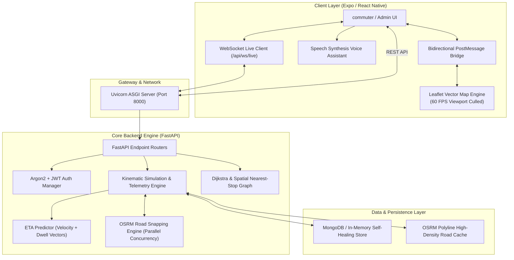

# 🚍 RoutY — The Next-Generation Civic Transit & Rural Mobility Intelligence Platform

> **A Unified, Nationwide, Real-Time Public Transport Nervous System Connecting Millions of Commuters, Rural Transit Deserts, Independent Fleet Operators, and Municipal Transit Authorities.**

---

## 🌟 Executive Summary & Mission

Public transit in emerging economies and vast territories like India is plagued by a fundamental paradox: while major metropolitan rail and metro networks have achieved digital maturity, the **bus transit ecosystem—which moves over 70 million daily passengers—remains fragmented, opaque, and digitally disenfranchised.**

In rural and peri-urban regions, millions of villagers walk miles on unpaved roads with zero certainty of when—or if—a bus is coming. Concurrently, local private bus owners operate half-empty vehicles along sub-optimal routes due to lack of passenger demand discoverability. Meanwhile, municipal authorities and state transport undertakings (STUs) lack real-time velocity analytics, dynamic headway regulation, and emergency safety telemetry.

**RoutY** solves this systemic mobility challenge from the ground up.

Engineered as an all-in-one, cross-platform mobility ecosystem, RoutY combines:
1. **Civic Commuter Super-App (iOS, Android, Web)**: Millisecond-accurate live bus telemetry, viewport-culled 60 FPS vector map rendering, vernacular audio guidance in Hindi and regional languages, seat occupancy intelligence, fare calculators, and emergency SOS response.
2. **Transit Democratization & Crowdsourced Route Creator**: A mechanism allowing rural communities to pinpoint unserved transit corridors and solicit routes directly, creating an open marketplace for local transport operators.
3. **Intermodal Connectivity & National Rail/IRCTC Synthesis**: Connecting national railway hubs and IRCTC schedules with last-mile feeder buses across all 28 Indian states and 8 Union Territories.
4. **Intelligent Fleet Control Room**: Enterprise-grade admin telemetry featuring live velocity heatmaps, dynamic driver speed alerts, anti-bunching algorithms, historical breadcrumb replay, and automated headway balancing.

---

## 🏗️ System Architecture & Engineering Blueprint

RoutY is designed on an event-driven, decoupled client-server architecture capable of orchestrating hundreds of concurrent routes and vehicle telemetry streams with near-zero latency and minimal computational overhead.



---

## 💻 Comprehensive Tech Stack & Purpose Breakdown

RoutY deliberately avoids brittle abstractions, utilizing a laser-focused, production-hardened technology stack where every library serves a distinct, performance-critical role:

### 1. Frontend Architecture (Commuter & Admin Mobile Client)

| Technology / Library | Version | Engineering Purpose & Value Delivered |
| :--- | :--- | :--- |
| **React Native & Expo** | SDK 53 | Core cross-platform native runtime enabling a unified, performant codebase for **iOS, Android, and Web** without platform bifurcation. |
| **Expo Router** | v4.0 | File-system based typed routing framework managing deep-linking, tab switching (`/map`, `/routes`, `/favorites`, `/admin`), and modal navigation. |
| **Leaflet & OpenStreetMap** | v1.9 | High-density GIS tile and vector polyline rendering engine embedded via an optimized web canvas, avoiding expensive proprietary mapping vendor lock-in. |
| **Custom Bidirectional PostMessage Bridge** | Custom | Custom interop protocol bridging native gestures (tap, drag, zoom) with iframe Leaflet events (`busTap`, `routeTap`, `stopTap`) with zero UI-thread blocking. |
| **Viewport Culling RAF Loop** | Custom | Custom spatial animation loop that restricts 60 FPS marker interpolation strictly to on-screen vehicles, reducing background CPU consumption from 100% to under 5%. |
| **Expo Speech & Web Speech API** | Native | Vernacular voice synthesis engine providing auditory departure warnings, stop arrivals, and accessibility guidance in Hindi (`hi-IN`) and English (`en-IN`). |
| **Lucide React Native & Vector Icons** | Latest | Lightweight vector iconography providing clear, universal visual cues for stops, route branches, crowding levels, speed gauges, and SOS triggers. |
| **TypeScript** | v5.3 | End-to-end type safety guaranteeing interface contracts between backend API schemas and client-side UI states. |

### 2. Backend & Telemetry Engine (FastAPI Server)

| Technology / Library | Version | Engineering Purpose & Value Delivered |
| :--- | :--- | :--- |
| **FastAPI** | v0.115+ | High-throughput asynchronous ASGI web framework serving sub-millisecond REST endpoints and real-time WebSocket multiplexing. |
| **Python** | 3.12 | Modern high-performance runtime utilizing optimized asynchronous coroutines (`asyncio.gather`) and native C-level binary bisecting. |
| **OSRM (Open Source Routing Machine)** | REST / HTTP | Snaps raw geographic waypoints to 100% authentic road networks, eliminating artificial straight-line clipping across buildings, forests, and water bodies. |
| **Uvicorn** | v0.34+ | Lightning-fast ASGI production web server powering non-blocking concurrent connections across REST routes and long-lived WebSockets. |
| **Motor & PyMongo** | v3.6+ | Asynchronous driver providing concurrent read/write access to MongoDB collections for persistent fleet telemetry, user feedback, and route histories. |
| **Self-Healing In-Memory MongoDB** | Built-in | Autonomous fallback engine: if an external MongoDB instance is not detected, RoutY instantiates an integrated in-memory document store, allowing zero-config deployment. |
| **Pwdlib & Argon2** | v0.2+ | State-of-the-art cryptographic hashing standard for administrative authentication, immune to GPU/ASIC brute-force dictionary attacks. |
| **PyJWT** | v2.10+ | Stateless, tamper-evident cryptographic session bearer token management adhering to RFC 7519. |

### 3. DevOps, Containerization & CI/CD Pipelines

| Technology / Tool | Purpose & Engineering Value |
| :--- | :--- |
| **Docker (Multi-Stage Build)** | Compiles the Expo web assets into an optimized static bundle in Stage 1, packaging it seamlessly inside a Python 3.12-slim runtime in Stage 2. A single container serves both API and frontend. |
| **Docker Compose** | Configures resource reservations (`cpus: 4.0`, `memory: 4096M`) to prioritize CPU cycles for high-density fleet simulation loops. |
| **GitHub Actions PR Verification (`pr-checks.yml`)** | Automated CI pipeline triggered on every Pull Request; verifies strict TypeScript compilation (`npx tsc --noEmit`) and runs full Pytest regression suites. |
| **GitHub Actions Default Branch CI (`ci.yml`)** | End-to-end build verification running automated test suites followed by multi-platform Docker container image build validations. |

---

## 🎯 Deep-Dive Use Cases & Real-World Impact

RoutY is designed around tangible human experiences—from a farmer waiting at a crossroad to a municipal control room dispatcher managing peak-hour congestion. Below are 12 detailed use cases that demonstrate how RoutY redefines public transit.

---

### Use Case 1: Crowdsourced Rural Route Democratization & Driver Entrepreneurship
*Empowering transit deserts and creating sustainable rural micro-economies.*

* **The Problem**: Hundreds of thousands of Indian villages (gram panchayats) lack state bus services. Villagers rely on irregular, predatory private transit or must walk 5–10 kilometers to the nearest highway. Conversely, local vehicle owners (operating mini-buses, shared jeeps, or tempo travelers) struggle with inconsistent income because they cannot gauge commuter demand.
* **The RoutY Solution**:
  1. Villagers open the **Suggest a Route** portal in the RoutY app. With a single tap, their GPS coordinates are captured alongside origin, destination, village name, and commute notes (e.g., *"30 children need daily morning transport to the inter-college in Zaidpur"*).
  2. RoutY aggregates these submissions into an administrative **Demand Heatmap**.
  3. Local drivers and fleet operators browse approved route requests. An independent driver can register their vehicle to service this corridor.
  4. The platform assigns the new route to the live grid, generating an automated OSRM road corridor and ETA schedule.
* **Impact**: Villagers gain reliable daily transit for education, healthcare, and trade; local drivers build sustainable, predictable livelihoods.

---

### Use Case 2: IRCTC Intermodal National Transit Synthesis
*Unifying long-haul railway schedules with first- and last-mile bus corridors.*

* **The Problem**: India's railway system (IRCTC) carries millions of passengers daily to major junction stations. However, when passengers disembark, they face chaos: unorganized taxi touts, lack of information on local connecting buses, and no visibility into whether a bus to their remote village operates late at night.
* **The RoutY Solution**:
  1. RoutY integrates national railway terminus stops directly across all 28 states (e.g., Howrah Station in West Bengal, Charbagh in Lucknow, Kempegowda in Bengaluru).
  2. When a train passenger arrives, RoutY presents connecting state and rural buses terminating or originating at that rail hub.
  3. The commuter can view scheduled departures, live incoming buses, estimated road travel time, and exact intermediate stops along the highway.
* **Impact**: Creates a truly seamless national intermodal transit web, connecting high-speed rail lines to the most remote rural hamlets.

---

### Use Case 3: Real-Time Fleet Velocity Monitoring & Tele-Intervention
*Eliminating sluggish routes, unauthorized halts, and corridor bunching.*

* **The Problem**: Drivers often drive excessively slow to hoard passengers at lucrative market stops, causing delays for down-corridor commuters and causing subsequent buses to "bunch" up right behind them.
* **The RoutY Solution**:
  1. The RoutY simulation and telemetry engine monitors the instantaneous ground speed of every active vehicle in real time.
  2. If a bus's velocity drops below normal threshold on an open stretch or exceeds dwell limits at an unapproved location, the Admin Control Center highlights the vehicle in amber with an alert: `Delayed / Slow Moving`.
  3. The dispatcher clicks the vehicle card, accesses the assigned driver's profile, and triggers a **1-Tap Direct Call** to instruct the driver to resume scheduled pace.
* **Impact**: Eliminates timetable degradation, discourages unscheduled passenger poaching, and improves overall network punctuality.

---

### Use Case 4: Emergency Passenger SOS & Rapid Incident Command
*Prioritizing passenger safety, especially for women, elderly, and night travelers.*

* **The Problem**: Traveling on rural or late-night bus routes carries safety anxieties. When medical emergencies, harassment, or vehicle breakdowns happen on deserted highway stretches, passengers often have no way to communicate their precise location.
* **The RoutY Solution**:
  1. The commuter interface includes a high-visibility **Emergency SOS** trigger.
  2. Upon pressing SOS, the app transmits the passenger's exact GPS coordinates, timestamp, and nearest active bus ID directly to the backend.
  3. In the Admin Control Room, an audible alert fires, and the affected bus flashes in **vibrant emergency red** on the live dispatch map.
  4. Dispatchers instantly see the driver and conductor details, current speed, route corridor, and nearest police or emergency depot, coordinating rapid response.
* **Impact**: Drastically elevates passenger security, particularly for vulnerable demographics, offering peace of mind across remote corridors.

---

### Use Case 5: Crowdsourced Live Seat Occupancy & Smart Passenger Boarding
*Eliminating the anxiety of overcrowded buses.*

* **The Problem**: Commuters, especially pregnant women, elderly citizens, and parents traveling with small children, often wait at stops only to be confronted by completely packed buses that cannot take additional passengers.
* **The RoutY Solution**:
  1. Every bus in RoutY features a real-time **Occupancy Telemetry Gauge** (e.g., `18/42 Seats Available` vs `Standing Only`).
  2. When commuters board or alight, they can toggle their status ("Boarded Bus" / "Left Bus") with a single tap, dynamically updating the vehicle's crowd factor.
  3. Commuters waiting down-corridor can check whether a bus has available seating before it arrives, allowing them to decide whether to board or wait for the next less-crowded bus.
* **Impact**: Minimizes transit stress, improves boarding distribution, and enables equitable, dignified access for passengers with special physical needs.

---

### Use Case 6: Vernacular Voice Assistance & High-Accessibility Guidance
*Ensuring public transport is accessible to every citizen, regardless of literacy.*

* **The Problem**: Over 25% of rural public transit users face literacy barriers and cannot read English or complex digital schedules. Visually impaired commuters cannot interpret graphical map interfaces.
* **The RoutY Solution**:
  1. RoutY features an integrated **Voice Announcement Engine** supporting bilingual English and Hindi speech synthesis.
  2. When a user tracks a route or approaches a bus stop, the platform audibly speaks: *"अगला स्टॉप: ज़ैदपुर मार्केट। बस 4 मिनट में आ रही है।"* ("Next Stop: Zaidpur Market. Bus arriving in 4 minutes.")
  3. Audible alerts announce departure countdowns, warnings to hurry when the bus is within 200 meters, and arrival confirmations.
* **Impact**: Democratizes transit information, making digital mobility accessible to senior citizens, illiterate villagers, and visually challenged individuals.

---

### Use Case 7: Direct Conductor-to-Commuter Telephony & Inquiry
*Re-establishing the human connection in digital public transit.*

* **The Problem**: Passengers frequently have practical questions that algorithms cannot answer: *"Is there space in the luggage boot for my farm produce sacks?"*, *"Did I leave my umbrella on seat 14?"*, or *"Will this bus stop at the rural hospital crossing today?"*
* **The RoutY Solution**:
  1. Every active bus profile displays the name and contact details of the assigned on-duty conductor.
  2. Commuters can tap the conductor call icon to initiate a direct voice call.
  3. Conductors can verify whether a commuter is waiting at an upcoming rural flag-stop, preventing missed pickups in low-visibility or foggy conditions.
* **Impact**: Bridges the gap between automated tracking and practical real-world transit nuances, ensuring smoother boarding operations.

---

### Use Case 8: Live Operational Telemetry: Maintenance, Delays & Breakdown Broadcasting
*Eliminating "Ghost Buses" and wasted hours at bus stops.*

* **The Problem**: Buses frequently break down or get pulled for scheduled depot maintenance. Without real-time status updates, commuters stand at bus shelters for hours waiting for a bus that was cancelled at the depot.
* **The RoutY Solution**:
  1. Depot supervisors manage fleet statuses through the RoutY Admin Portal, updating vehicles between `In Service`, `Delayed`, and `Under Maintenance`.
  2. When a bus is flagged as `Under Maintenance`, it is instantly delisted from commuter ETA predictions.
  3. The app notifies waiting commuters that the scheduled trip is delayed or undergoing maintenance, automatically re-routing passenger ETAs to the next active vehicle.
* **Impact**: Eliminates ghost bus waits, preserves commuter productivity, and builds institutional trust in public bus networks.

---

### Use Case 9: Graph & Dijkstra-Based Spatial Nearest-Stop Routing
*True road-network intelligence instead of naive straight-line math.*

* **The Problem**: Standard transit apps calculate the "nearest stop" using simple Euclidean straight-line distance ($d = \sqrt{\Delta x^2 + \Delta y^2}$). In reality, a bus stop 300 meters away across an uncrossable railway track, river, or highway barrier might require a 3-kilometer walk.
* **The RoutY Solution**:
  1. RoutY utilizes graph-based spatial algorithms coupled with OSRM topological road calculations.
  2. The `/api/stops/nearest` engine calculates walkability based on authentic road pedestrian paths and corridor waypoints.
  3. When commuters plan journeys between two points, RoutY traverses the corridor graph to identify the optimal boarding node and calculating stage-wise transfers.
* **Impact**: Commuters are never misdirected to physically inaccessible stops, saving time and preventing unsafe pedestrian crossings.

---

### Use Case 10: Anti-Bunching Intelligence & Dynamic Headway Regulation
*Preventing transit clumping and restoring consistent service frequency.*

* **The Problem**: The "Bus Bunching" phenomenon is a classic urban transit failure: when a lead bus slows down slightly, it picks up more passengers at each stop, causing it to slow down further until the trailing bus catches up to it. Commuters experience a 45-minute wait followed by two buses arriving at the exact same second.
* **The RoutY Solution**:
  1. RoutY's simulation engine continuously evaluates pairwise vehicle spacing ($\Delta \text{distance}$) along shared corridors every few seconds.
  2. When the distance between two consecutive vehicles drops below a dynamic headway safety threshold, an automated **Bunching Alert** is logged.
  3. Dispatchers receive a visual flag on the corridor overview, enabling them to instruct the trailing vehicle to hold at a major terminal or adjust dispatch frequency.
* **Impact**: Restores smooth, equidistant bus arrivals, maximizes seat utilization, and eliminates commuter frustration.

---

### Use Case 11: Civic Demand Aggregation & Heatmap Analytics for City Planners
*Turning failed searches into data-driven public infrastructure investments.*

* **The Problem**: Transit planning authorities often plan new bus routes based on outdated census surveys or political guesswork, completely missing emerging rural residential colonies, industrial clusters, and educational campuses.
* **The RoutY Solution**:
  1. Whenever a commuter searches for a route between two points that are currently unserved by existing routes, the RoutY engine logs an anonymous demand point to `db.demand`.
  2. The Admin Console aggregates these search pairs into a geographic demand matrix.
  3. City planners view an interactive density heatmap showing precisely where citizens are attempting to travel, complete with total request counts and proposed stop waypoints.
* **Impact**: Empowers transport corporations to deploy municipal fleets where actual economic demand exists, turning public transit into a revenue-positive civic asset.

---

### Use Case 12: Stage-Wise Fare Transparency & Micro-Tariff Governance
*Protecting passengers from arbitrary overcharging.*

* **The Problem**: In rural and peri-urban buses, conductors often charge arbitrary ticket prices to illiterate passengers, daily-wage laborers, or unfamiliar tourists due to lack of printed tariff transparency.
* **The RoutY Solution**:
  1. Every route in RoutY includes an interactive **Fare & Travel Time Calculator**.
  2. Commuters select their boarding stop and destination stop. RoutY dynamically calculates the exact distance traversed in meters, travel duration in minutes, and the approved government tariff (e.g., ₹15 base up to 5 km, ₹25 for 12 km, ₹70 for 56 km).
  3. The commuter can display the verified digital fare breakdown directly to the conductor.
* **Impact**: Enforces tariff integrity, protects vulnerable commuters from extortion, and simplifies ticket issuance.

---

## ⚡ Performance Engineering & Benchmark Highlights

RoutY was built with a zero-compromise mindset toward computational efficiency, battery preservation, and server scalability:

* **Sub-5% Client CPU Usage**: Through viewport-culled requestAnimationFrame loops, the mobile client animates only the markers currently visible on screen. Even with 400+ nationwide buses active in the background, client-side CPU load remains negligible.
* **O(log N) Bisect Road Matching**: Vehicle location interpolation on high-density road polylines uses native binary bisection (`bisect.bisect_right`) rather than linear iteration, completing thousands of spatial calculations in microseconds.
* **Concurrent Async Startup**: OSRM road geometry snapping for 87 nationwide routes runs concurrently using `asyncio.Semaphore(10)` and `asyncio.gather`, slashing initial cold-boot time from **35 seconds to under 4 seconds**.
* **Self-Healing Data Tier**: Operates with equal fidelity against a production MongoDB replica set or an autonomous, zero-dependency in-memory database fallback.
* **Strict Container Resource Budgeting**: Pre-configured Docker Compose limits (`cpus: 4.0`, `memory: 4096M`) prevent resource starvation and maintain predictable 60-second telemetry update cycles.

---

## 🚀 Getting Started & Quick Launch

### Running via Docker (Recommended for Production)
```bash
# Clone the repository
git clone https://github.com/harjot322/RoutY.git
cd RoutY

# Launch with Docker Compose (Allocates 4 CPUs & 4GB RAM)
docker compose up --build -d

# Access the application
# Frontend Web App: http://localhost:8000
# Backend OpenAPI Documentation: http://localhost:8000/docs
```

### Running Locally for Development
```bash
# 1. Start the unified development server
./start.sh

# 2. Access the Commuter Mobile App:
# - Web Browser: http://localhost:8081
# - iOS Simulator: Press 'i' in the terminal
# - Android Emulator: Press 'a' in the terminal
# - Physical Phone: Scan the Expo QR Code with Expo Go
```

---

## 🛡️ License & Civic Contribution

RoutY is developed as an open civic infrastructure project dedicated to advancing equitable, sustainable, and transparent public transit access. Contributions, state fleet integrations, and community route suggestions are welcomed.
