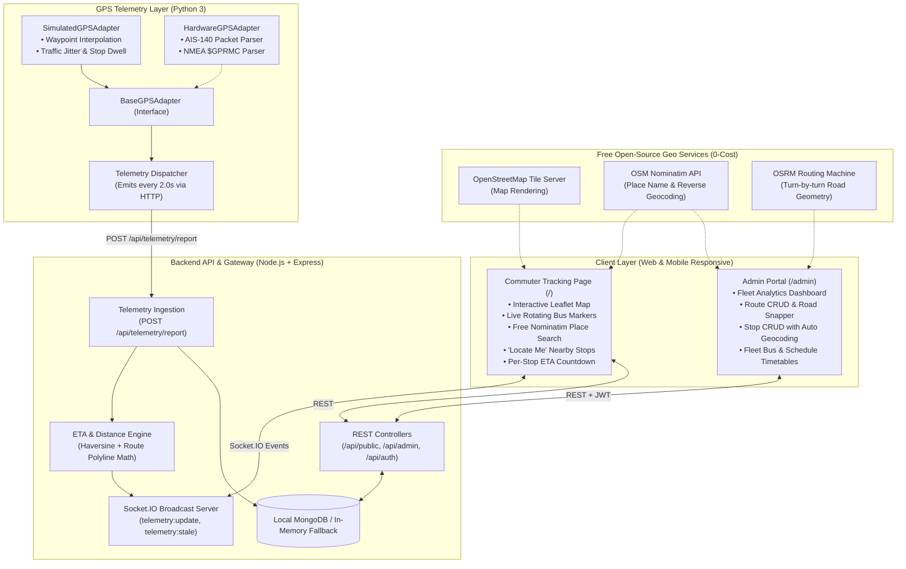

# RoutY: A Real-Time Public Transport Tracking System for Small and Tier-2 Cities

[](https://nodejs.org)
[](https://expressjs.com)
[](https://socket.io)
[](https://react.dev)
[](https://leafletjs.com)
[](LICENSE)

> **BTech Minor Project Prototype**  
> **Target Context**: Tier-2 City Public Transport (e.g., Bhopal, Indore, Lucknow, Jaipur, India)  
> **Upstream Attribution**: Adapted and evolved from [TrackMate](https://github.com/Maganti-Praveen/TrackMate.git) by Praveen Maganti.

---

## 1. Executive Summary & Project Motivation

Public bus transit remains the lifeblood of mobility in India's small and Tier-2 cities. However, commuters routinely face significant uncertainty: lack of live tracking, unpredictable wait times at unshaded stops, and no reliable arrival estimates. While metropolitan transit systems (like Delhi or Bangalore) rely on expensive commercial tracking solutions, proprietary Google Maps APIs, and costly cloud subscriptions, smaller municipal corporations and college fleets cannot afford recurring API bills or specialized hardware.

**RoutY** solves this challenge through a **100% software-driven, zero-cost architecture**:
- **Zero Paid APIs**: Runs entirely on **OpenStreetMap (OSM)** tiles, **Nominatim Geocoding**, and the **OSRM Road Routing Engine**.
- **Automated Place Name Detection**: Commuters and administrators can search by landmark or place name (e.g., *"Railway Station"* or *"MP Nagar Zone 1"*), automatically detecting coordinates without manually typing latitudes and longitudes.
- **Dynamic Per-Stop ETAs**: Computes real-time arrival estimates using vehicle speed, remaining distance along GeoJSON road geometry, and passenger dwell times.
- **Replaceable GPS Adapter Architecture**: Includes a standalone Python simulator emitting real-time telemetry, designed with an abstract adapter interface so physical AIS-140 / NMEA hardware trackers can be connected seamlessly.
- **Embedded Database Resilience**: Connects to local MongoDB, with an automatic **in-memory database fallback** (`mongodb-memory-server`) so the prototype runs out of the box on any evaluator's machine without setup friction.

---

## 2. System Architecture



---

## 3. Key Features

### For Commuters (No Login Required)
1. **Interactive Civic Map**: View all operating city routes and live animated buses rendered on OpenStreetMap tiles.
2. **Directional Bus Markers**: Bus markers rotate dynamically according to vehicle heading (`bearing`), show route color tags, and display live speed badges.
3. **Automated Place Name Search**: Click the search bar and type any landmark (e.g. *"Railway Station"*, *"Bairagarh"*, *"AIIMS"*). Powered by free OpenStreetMap Nominatim, it automatically pans the map and highlights nearby stops.
4. **"Near Me" Geolocation**: Click *Locate Me* to detect your current browser GPS position, find the nearest bus stop, and view walking distance in meters and minutes.
5. **Real-Time Stop ETAs**: Select any route or bus to view a step-by-step progress timeline of upcoming stops with countdown arrival times (e.g. *"Arriving now"*, *"3 min"*, *"14 min"*).
6. **Stale Data Detector**: Automatically highlights vehicles whose telemetry has stopped or experienced signal dropouts (>30s) as "Signal Paused".

### For Administrators
1. **Secure Admin Authentication**: Simple, secure JWT authentication with seeded development credentials.
2. **Fleet Analytics Dashboard**: Real-time KPI counters for active routes, registered stops, total fleet size, active buses on the road, and fleet average speed.
3. **Route Management & Road Snapper**:
   - Create and edit routes.
   - Add stops via automated place search or drop pins.
   - Reorder stops using Up/Down controls.
   - **Snap Road Path**: Calls OSRM to automatically generate realistic road-following curves between stops.
4. **Stop Management**: Register stops with automatic place name detection and reverse geocoding.
5. **Fleet Vehicle CRUD**: Add buses, assign them to routes, and toggle operational status (`active`, `idle`, `maintenance`).
6. **Service Schedules**: Manage daily operating hours, departure timetables, and headway frequencies.

---

## 4. Zero-Cost Free-Tier Guarantee

| Requirement | Conventional Paid Stack | RoutY Zero-Cost Stack | Cost |
| :--- | :--- | :--- | :--- |
| **Map Rendering** | Google Maps JavaScript API | Leaflet.js + OpenStreetMap Tiles | **₹0 (Free)** |
| **Place Search** | Google Places API ($17 / 1k req) | OpenStreetMap Nominatim API | **₹0 (Free)** |
| **Reverse Geocoding** | Google Geocoding API | OpenStreetMap Nominatim Reverse | **₹0 (Free)** |
| **Road Snapping** | Google Directions API | Open Source Routing Machine (OSRM) | **₹0 (Free)** |
| **Live Commuter Push** | Paid Web-Push / Firebase Cloud | Self-Hosted Socket.IO WebSockets | **₹0 (Free)** |
| **Database** | MongoDB Atlas Cloud | Local MongoDB / `mongodb-memory-server` | **₹0 (Free)** |
| **GPS Hardware** | Physical AIS-140 Hardware Tracker | Standalone Python Simulation Service | **₹0 (Free)** |

---

## 5. Replaceable GPS Adapter Architecture

RoutY implements the **Adapter Design Pattern** in `simulator/adapters/base.py` to ensure complete decoupling between telemetry generation and application logic:

- `BaseGPSAdapter`: Abstract base class defining the telemetry contract:
  ```python
  class BaseGPSAdapter(ABC):
      def get_telemetry(self) -> dict:
          """Returns: bus_id, bus_number, route_id, latitude, longitude, bearing, speed_kmh, timestamp"""
          pass
  ```
- `SimulatedGPSAdapter` *(Default)*: Interpolates coordinates along route GeoJSON paths at realistic city speeds (25–45 km/h), incorporates dwell times (15s) at stops for passenger boarding, and introduces natural traffic speed variations.
- `HardwareGPSAdapter`: Production-ready adapter equipped with parsers for:
  1. **NMEA 0183** sentences (`$GPRMC`) used by standard USB/Bluetooth GPS pucks.
  2. **AIS-140** telemetry packets mandated by the Ministry of Road Transport and Highways (MoRTH), India.

---

## 6. Prerequisites & Installation

### Prerequisites
- **Node.js** v18.0 or higher
- **Python** 3.9 or higher
- **Docker & Docker Compose** *(Optional, for containerized deployment)*

### Local Setup (Quickstart)

#### Option A: One-Command Startup (macOS / Linux)
```bash
./start.sh
```
*This starts the Backend (port 5000), Python Simulator, and React Frontend (port 5173).*

#### Option B: One-Command Startup (Windows)
```cmd
start.bat
```

#### Option C: Docker Compose (All Services)
```bash
docker compose up --build
```

#### Option D: Manual Step-by-Step

1. **Start the Backend**:
   ```bash
   cd backend
   npm install
   npm start
   ```
   *The backend starts at `http://localhost:5000`. If local MongoDB is not running, it automatically spins up an embedded in-memory MongoDB instance.*

2. **Start the GPS Simulator**:
   ```bash
   cd simulator
   python3 main.py
   ```
   *The simulator connects to the backend and emits live positions for 6 buses across 3 routes every 2 seconds.*

3. **Start the Frontend**:
   ```bash
   cd frontend
   npm install
   npm run dev
   ```
   *Open `http://localhost:5173` in your browser.*

---

## 7. Default Credentials & Seed Data

### Default Admin Account (Development & Evaluation)
- **URL**: `http://localhost:5173/admin/login`
- **Username**: `admin`
- **Password**: `RoutYAdmin2026!`
*(An **Autofill** button is provided directly on the login screen for quick evaluation).*

### Seeded Routes & Fleet (Bhopal City Context)
The backend automatically seeds 3 realistic transit routes with 19 stops and 6 active electric buses:
- **Route R-101 (Civic Blue)**: *Bhopal Junction – MP Nagar – AIIMS Hospital* (7 stops, 2 buses: `MP04-HE-1001`, `MP04-HE-1002`)
- **Route R-204 (Emerald Green)**: *Bairagarh – VIP Road Promenade – New Market* (6 stops, 2 buses: `MP04-HE-1003`, `MP04-HE-1004`)
- **Route R-305 (Civic Amber)**: *Raja Bhoj Airport – Karond Mandi – Central Library* (6 stops, 2 buses: `MP04-HE-1005`, `MP04-HE-1006`)

---

## 8. API & Socket.IO Specification

### REST API Endpoints

| Method | Endpoint | Description | Auth Required |
| :--- | :--- | :--- | :--- |
| `GET` | `/api/public/config` | System configuration (city, map center, zoom) | Public |
| `GET` | `/api/public/routes` | All active transit routes with stops and geometry | Public |
| `GET` | `/api/public/routes/:id` | Route details with assigned buses and schedules | Public |
| `GET` | `/api/public/stops` | Directory of all transit stops | Public |
| `GET` | `/api/public/buses` | Fleet vehicles with last known telemetry and ETAs | Public |
| `GET` | `/api/public/schedules` | Operating timetable and headway frequencies | Public |
| `GET` | `/api/public/nearest-stops?lat=...&lng=...` | Proximity search for stops closest to commuter | Public |
| `POST` | `/api/auth/login` | Admin login; returns JWT token | Public |
| `POST` | `/api/telemetry/report` | GPS telemetry ingestion endpoint | Public (Simulator/Hardware) |
| `GET` | `/api/admin/dashboard` | Fleet KPI metrics & telemetry health | Admin JWT |
| `POST` | `/api/admin/routes` | Create new transit route | Admin JWT |
| `PUT` | `/api/admin/routes/:id` | Update route details or order of stops | Admin JWT |
| `DELETE`| `/api/admin/routes/:id` | Delete route | Admin JWT |
| `POST` | `/api/admin/stops` | Create transit stop with coordinates | Admin JWT |
| `POST` | `/api/admin/buses` | Register bus into fleet | Admin JWT |
| `POST` | `/api/admin/schedules` | Create timetable schedule | Admin JWT |

### Real-Time Socket.IO Events

| Event Name | Direction | Payload |
| :--- | :--- | :--- |
| `connection:ack` | Server → Client | Acknowledgement with server timestamp |
| `telemetry:update` | Server → Client | `{ bus_id, bus_number, route_id, latitude, longitude, bearing, speed_kmh, next_stop_name, distance_to_next_stop_m, eta_to_next_stop_sec, etas, timestamp }` |
| `telemetry:stale` | Server → Client | `{ bus_id, bus_number, is_stale: true, last_reported }` |

---

## 9. Automated Testing & Verification

Run the automated test suites to verify ETA calculation and simulator behavior:

### Backend Tests (ETA Math, Bearing & Stationary Fallback)
```bash
cd backend
npm test
```
*Expected output: 5 passing test suites covering Haversine distance, bearing trigonometry, string formatting, downstream stop ETA projection, and stationary divide-by-zero fallback.*

### Simulator Tests (Movement Interpolation & Hardware Parsers)
```bash
python3 -m unittest discover -s simulator/tests
```
*Expected output: 5 passing tests verifying distance calculation, simulated movement progression, NMEA `$GPRMC` parsing, and AIS-140 packet parsing.*

---

## 10. Upstream Attribution

This project incorporates design concepts and foundational tracking workflows from **[TrackMate](https://github.com/Maganti-Praveen/TrackMate.git)** by Praveen Maganti, licensed under the MIT License. RoutY extends this work by:
1. Re-architecting from institutional school tracking into a civic Tier-2 public bus transit platform.
2. Introducing 100% free-tier automated place detection via OpenStreetMap Nominatim and OSRM.
3. Implementing the modular `BaseGPSAdapter` design pattern with standalone Python simulation.
4. Adding automatic embedded in-memory MongoDB resilience for evaluation.

---

## 11. Project Team & Submission Details

- **Project Title**: *RoutY: A Real-Time Public Transport Tracking System for Small and Tier-2 Cities*
- **Degree**: Bachelor of Technology (B.Tech) - Minor Project
- **Target Context**: Tier-2 Civic Mobility / College Transit
